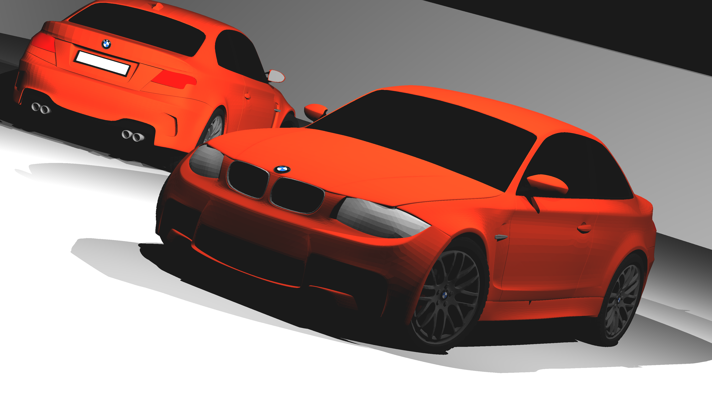
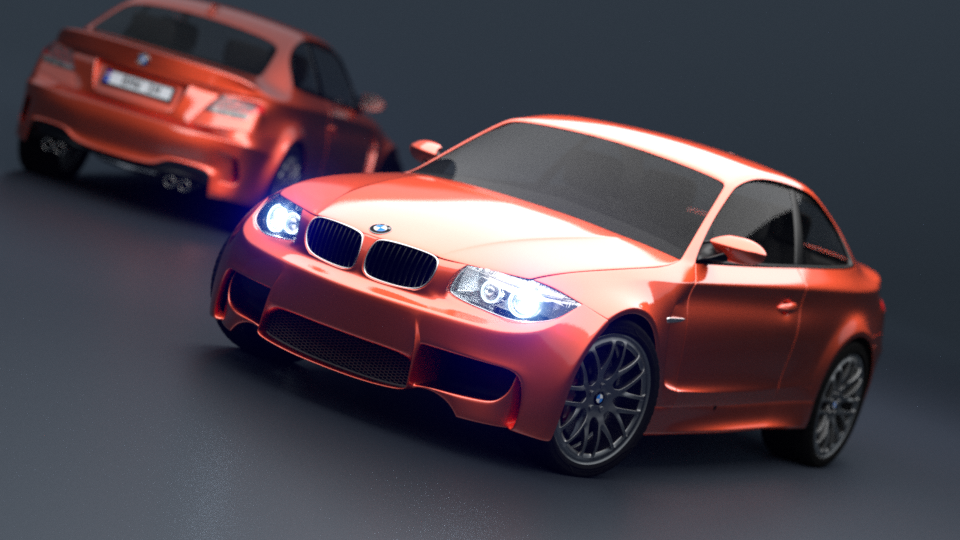
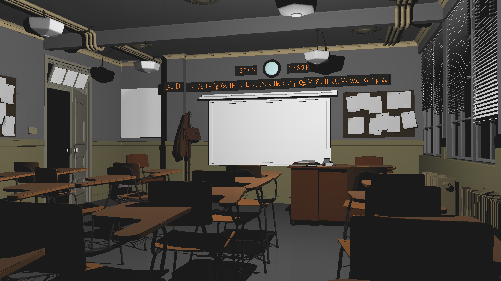

I implemented a decent BVH for my raytracer. It builds the hierarchy top down, splitting a node based on the surface area heuristic (i.e. minimizing sum of size of bounding box * number of objects). 

We will consider all possible divisions on each dimension. Naively, if there's n objects at our node, this can take O(n^2), but it's trivial and obvious to speed this up to O(n log n) by preprocessing prefixes and suffixes. However, that is still slow. Assuming we split evenly, the complexity can be O(n log^2 n), which can be slow if n > 1e5. However, we can see that we don't need to resort at every node, as long as we sort initially, and maintain the ordering for each axis as we partition our objects. This can be done with std::stable_partition. 

Therefore, the total complexity to build the BVH, if we have n objects in total, can be about O(n log n), assuming we split nodes evenly. In practice, this way is maybe 90% faster than the O(n log^2 n) way. However, the constant factor is still quite high, and it takes around 6 seconds to build a BVH when n ~ 2e6. Probably, this is because the SAH doesn't produce very balanced trees, so we end up with a worse complexity. Indeed, the height of the BVH in a case with n ~ 2e6 is 32, much is much larger than log2(2e6). 

It should be straightforward to write this process iteratively in a BFS fashion, so that it can be easily parallelized. However, I wrote it recursively as it's more straightforward. 

The trees generated by this BVH method are pretty good: in most scenes, the actual rendering takes less than a second (even at high resolutions), while it may take a few seconds to build the BVH. 

To test my BVH, I wrote a program to convert Blender scenes to our format. More specifically, I needed to export from Blender in .obj, and then parse .obj and convert into our format. And I was too lazy to convert vertex normals, so things look kind of trianglely. 

Here's some test scenes:

The first is the famous Blender BMW test. For some reason, it's been removed from the Blender site now.



Of course, .obj exports don't include any camera information, so I had to write a python script to dump the camera information from Blender. Also, there's no lighting, so I just randomly put some lights around. Here are the stats for the scene, rendered at 3840x2160:

```
total verts 365260
total tris 699798
bvh took 1506 height 33 size 455065
render took 1605
```
Times are in milliseconds.

You can compare it to a real Blender render:



Also, there's no real specular information in the materials exported in .mtl (it's all just 0.5 0.5 0.5, which is wrong), so everything looks a little matte. 

Next we have classroom. 



```
total verts 1359166
total tris 2674400
bvh took 6269 height 32 size 1737203
render took 3039
```

